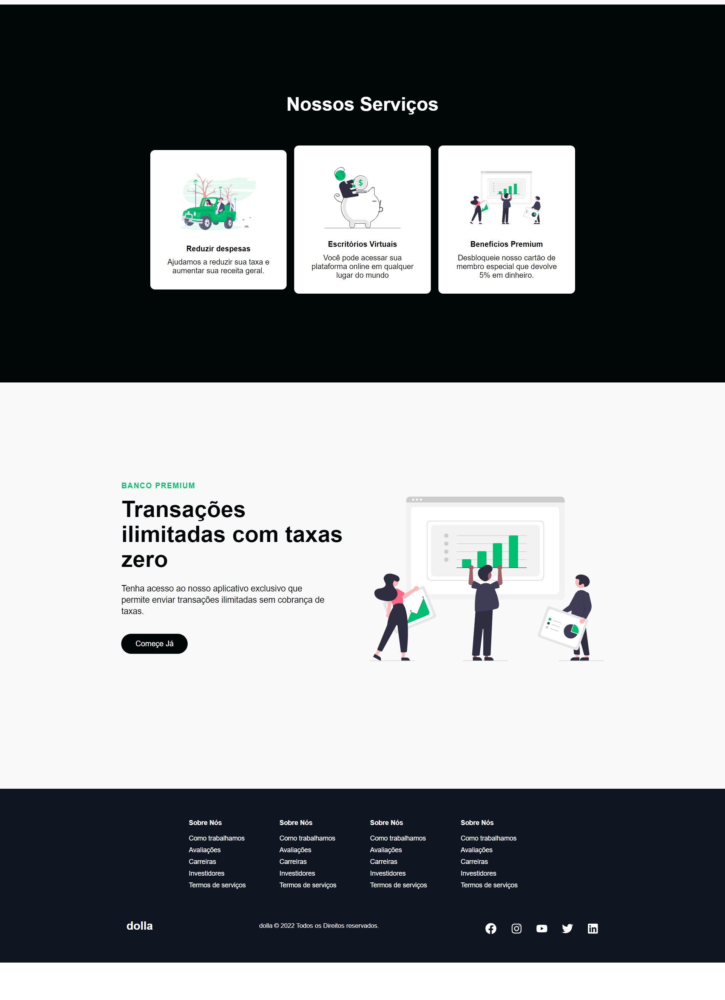

# React Dolla Responsivo

[Demo Dolla](https://react-smooth-responsiva.netlify.app/)

  
  

## Resumo

Dolla é uma aplicação web criada utilizando React, React Router e Sass. A rota utilzada foi configurada para uma página de login simulando uma conta em banco real.

## Motivation
O Objetivo desse projeto era se familiarizar com react.

## Install dependencies

`npm install`

## Run Snap Shot from the root directory.

`npm start`

## Built With

- React js
- React Router
- Sass

## Features

**1. Design Responsivo.**

**2. Multi-pages.**

